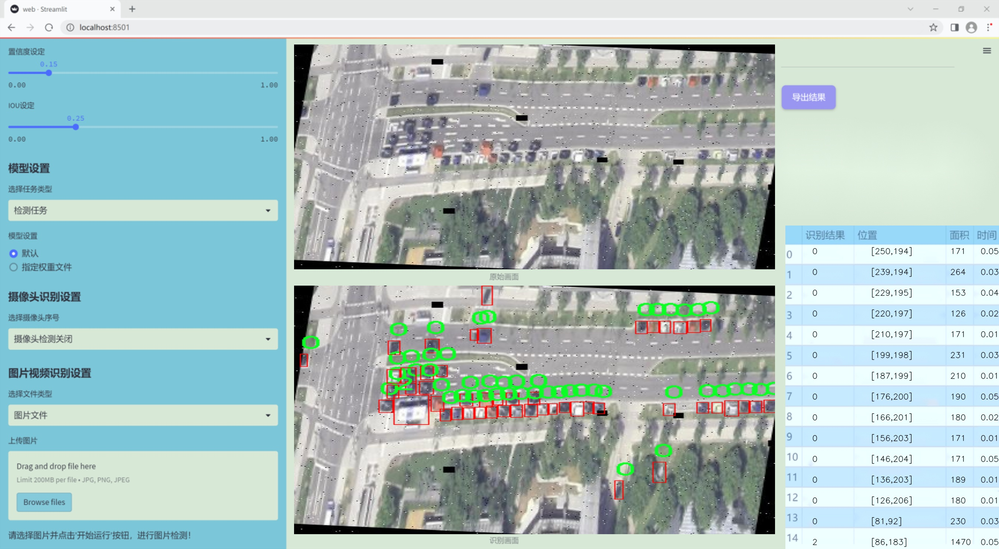
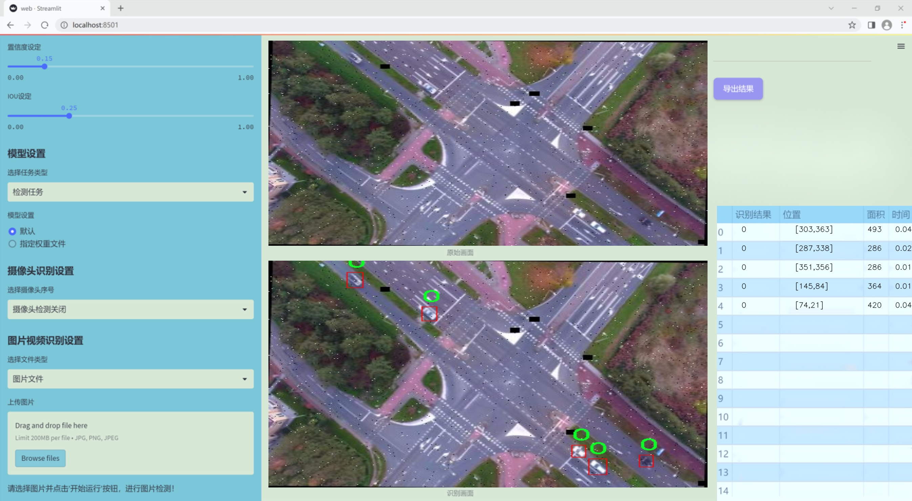
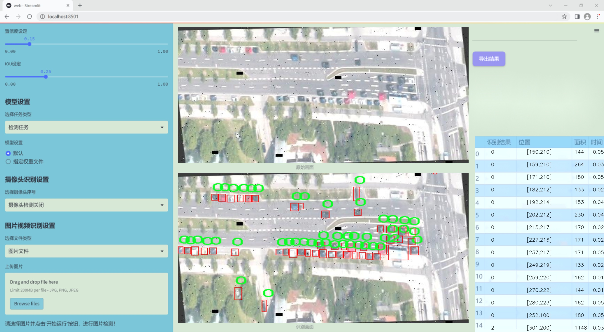
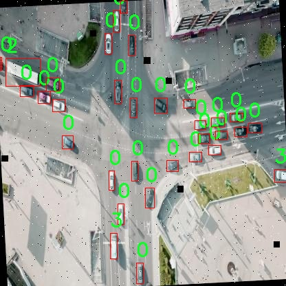
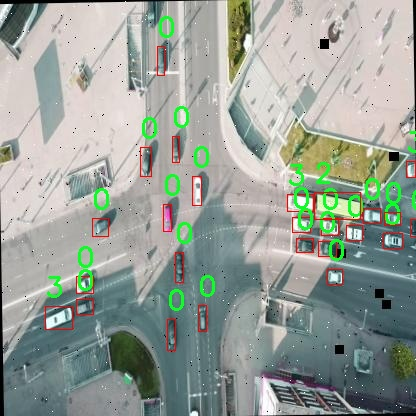
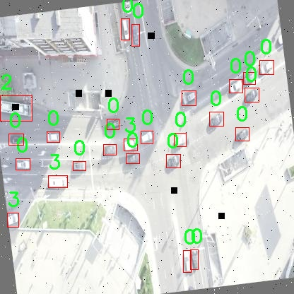
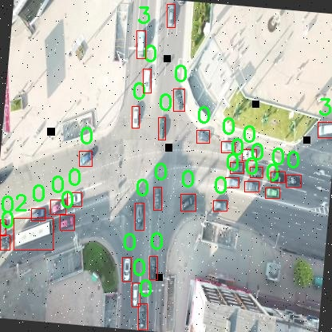
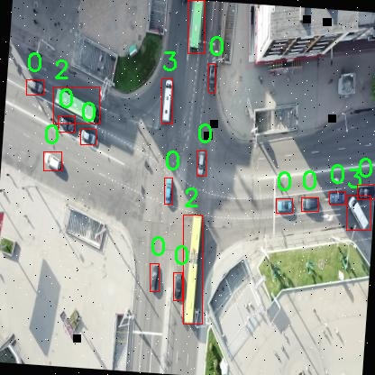

# 改进yolo11-RCSOSA等200+全套创新点大全：航拍车辆检测系统源码＆数据集全套

### 1.图片效果展示







##### 项目来源 **[人工智能促进会 2024.10.22](https://kdocs.cn/l/cszuIiCKVNis)**

##### 注意：由于项目一直在更新迭代，上面“1.图片效果展示”和“2.视频效果展示”展示的系统图片或者视频可能为老版本，新版本在老版本的基础上升级如下：（实际效果以升级的新版本为准）

  （1）适配了YOLOV11的“目标检测”模型和“实例分割”模型，通过加载相应的权重（.pt）文件即可自适应加载模型。

  （2）支持“图片识别”、“视频识别”、“摄像头实时识别”三种识别模式。

  （3）支持“图片识别”、“视频识别”、“摄像头实时识别”三种识别结果保存导出，解决手动导出（容易卡顿出现爆内存）存在的问题，识别完自动保存结果并导出到tempDir中。

  （4）支持Web前端系统中的标题、背景图等自定义修改。

  另外本项目提供训练的数据集和训练教程,暂不提供权重文件（best.pt）,需要您按照教程进行训练后实现图片演示和Web前端界面演示的效果。

### 2.视频效果展示

[2.1 视频效果展示](https://www.bilibili.com/video/BV1BPypYyEjt/)

### 3.背景

研究背景与意义

随着城市化进程的加快，交通管理与车辆监控成为现代城市治理的重要组成部分。传统的车辆检测方法往往依赖于人工监控或固定摄像头，这不仅效率低下，而且难以应对复杂的交通环境。近年来，随着无人机技术的迅猛发展，航拍成为获取交通数据的新兴手段。航拍技术能够从空中全方位观察交通状况，为车辆检测提供了新的视角和可能性。然而，如何高效、准确地从航拍图像中识别和分类车辆，仍然是一个亟待解决的技术难题。

在此背景下，基于改进YOLOv11的航拍车辆检测系统应运而生。YOLO（You Only Look Once）系列模型以其高效的实时检测能力和优异的准确性，广泛应用于目标检测领域。YOLOv11作为该系列的最新版本，进一步优化了检测速度和精度，特别适合于动态变化的航拍场景。通过对YOLOv11进行改进，结合航拍图像的特性，我们能够提升车辆检测的准确性和实时性，从而为交通管理提供更为可靠的数据支持。

本研究所使用的数据集“Aerial Cars”包含153幅航拍图像，专注于车辆的检测任务。尽管图像数量相对较少，但通过精心设计的模型训练和数据增强技术，可以有效提升模型的泛化能力。此外，该数据集的类别设置简单明了，涵盖了多种车辆类型，为后续的检测算法优化提供了良好的基础。通过对该数据集的深入分析与处理，我们希望能够推动航拍车辆检测技术的发展，为智能交通系统的构建提供坚实的技术支持，最终实现城市交通的智能化管理与优化。

### 4.数据集信息展示

##### 4.1 本项目数据集详细数据（类别数＆类别名）

nc: 4
names: ['0', '1', '2', '3']


该项目为【目标检测】数据集，请在【训练教程和Web端加载模型教程（第三步）】这一步的时候按照【目标检测】部分的教程来训练

##### 4.2 本项目数据集信息介绍

本项目数据集信息介绍

本项目所使用的数据集名为“Aerial Cars”，旨在为改进YOLOv11的航拍车辆检测系统提供高质量的训练数据。该数据集专注于航拍视角下的车辆检测，包含了多种不同类型的车辆样本，旨在提升模型在实际应用中的检测精度和鲁棒性。数据集中共包含四个类别，分别用数字“0”、“1”、“2”和“3”进行标识。这些类别可能代表不同类型的车辆，如小型轿车、SUV、货车和公共交通工具等，具体的类别定义将在后续的研究中进一步明确。

“Aerial Cars”数据集的构建过程经过精心设计，确保数据的多样性和代表性。数据集中的图像均为航拍视角，涵盖了不同的天气条件、时间段和地理位置，以模拟真实世界中可能遇到的各种场景。这种多样性不仅有助于提高模型的泛化能力，还能有效应对不同环境下的车辆检测挑战。此外，数据集中的每一张图像均配有详细的标注信息，确保训练过程中模型能够准确学习到各个类别的特征。

在数据预处理阶段，我们对图像进行了标准化处理，以适应YOLOv11的输入要求。通过对图像进行缩放、裁剪和增强等操作，进一步丰富了数据集的内容，提高了模型的训练效果。最终，我们希望通过“Aerial Cars”数据集的应用，能够显著提升航拍车辆检测系统的性能，使其在实际应用中更具实用性和可靠性。











### 5.全套项目环境部署视频教程（零基础手把手教学）

[5.1 所需软件PyCharm和Anaconda安装教程（第一步）](https://www.bilibili.com/video/BV1BoC1YCEKi/?spm_id_from=333.999.0.0&vd_source=bc9aec86d164b67a7004b996143742dc)


[5.2 安装Python虚拟环境创建和依赖库安装视频教程（第二步）](https://www.bilibili.com/video/BV1ZoC1YCEBw?spm_id_from=333.788.videopod.sections&vd_source=bc9aec86d164b67a7004b996143742dc)

### 6.改进YOLOv11训练教程和Web_UI前端加载模型教程（零基础手把手教学）

[6.1 改进YOLOv11训练教程和Web_UI前端加载模型教程（第三步）](https://www.bilibili.com/video/BV1BoC1YCEhR?spm_id_from=333.788.videopod.sections&vd_source=bc9aec86d164b67a7004b996143742dc)


按照上面的训练视频教程链接加载项目提供的数据集，运行train.py即可开始训练



     Epoch   gpu_mem       box       obj       cls    labels  img_size
     1/200     20.8G   0.01576   0.01955  0.007536        22      1280: 100%|██████████| 849/849 [14:42<00:00,  1.04s/it]
               Class     Images     Labels          P          R     mAP@.5 mAP@.5:.95: 100%|██████████| 213/213 [01:14<00:00,  2.87it/s]
                 all       3395      17314      0.994      0.957      0.0957      0.0843

     Epoch   gpu_mem       box       obj       cls    labels  img_size
     2/200     20.8G   0.01578   0.01923  0.007006        22      1280: 100%|██████████| 849/849 [14:44<00:00,  1.04s/it]
               Class     Images     Labels          P          R     mAP@.5 mAP@.5:.95: 100%|██████████| 213/213 [01:12<00:00,  2.95it/s]
                 all       3395      17314      0.996      0.956      0.0957      0.0845

     Epoch   gpu_mem       box       obj       cls    labels  img_size
     3/200     20.8G   0.01561    0.0191  0.006895        27      1280: 100%|██████████| 849/849 [10:56<00:00,  1.29it/s]
               Class     Images     Labels          P          R     mAP@.5 mAP@.5:.95: 100%|███████   | 187/213 [00:52<00:00,  4.04it/s]
                 all       3395      17314      0.996      0.957      0.0957      0.0845


###### [项目数据集下载链接](https://kdocs.cn/l/cszuIiCKVNis)

### 7.原始YOLOv11算法讲解


###### YOLOv11改进方向

与YOLOv 10相比，YOLOv 11有了巨大的改进，包括但不限于：

  * 增强的模型结构：模型具有改进的模型结构，以获取图像处理并形成预测
  * GPU优化：这是现代ML模型的反映，GPU训练ML模型在速度和准确性上都更好。
  * 速度：YOLOv 11模型现在经过增强和GPU优化以用于训练。通过优化，这些模型比它们的前版本快得多。在速度上达到了25%的延迟减少！
  * 更少的参数：更少的参数允许更快的模型，但v11的准确性不受影响
  * 更具适应性：更多支持的任务YOLOv 11支持多种类型的任务、多种类型的对象和多种类型的图像。

###### YOLOv11功能介绍

Glenn Jocher和他的团队制作了一个令人敬畏的YOLOv 11迭代，并且在图像人工智能的各个方面都提供了YOLO。YOLOv 11有多种型号，包括：

  * 对象检测-在训练时检测图像中的对象
  * 图像分割-超越对象检测，分割出图像中的对象
  * 姿态检测-当用点和线训练时绘制一个人的姿势
  * 定向检测（OBB）：类似于对象检测，但包围盒可以旋转
  * 图像分类-在训练时对图像进行分类

使用Ultralytics Library，这些模型还可以进行优化，以：

  * 跟踪-可以跟踪对象的路径
  * 易于导出-库可以以不同的格式和目的导出
  * 多场景-您可以针对不同的对象和图像训练模型

此外，Ultralytics还推出了YOLOv 11的企业模型，该模型将于10月31日发布。这将与开源的YOLOv
11模型并行，但将拥有更大的专有Ultralytics数据集。YOLOv 11是“建立在过去的成功”的其他版本的之上。

###### YOLOv11模型介绍

YOLOv 11附带了边界框模型（无后缀），实例分割（-seg），姿态估计（-pose），定向边界框（-obb）和分类（-cls）。

这些也有不同的尺寸：纳米（n），小（s），中（m），大（l），超大（x）。


YOLOv11模型

###### YOLOv11与前版本对比

与YOLOv10和YOLOv8相比，YOLOv11在Ultralytics的任何帖子中都没有直接提到。所以我会收集所有的数据来比较它们。感谢Ultralytics：

**检测：**


YOLOv11检测统计


YOLOv10检测统计

其中，Nano的mAPval在v11上为39.5，v10上为38.5；Small为47.0 vs 46.3，Medium为51.5 vs
51.1，Large为53.4 vs 53.2，Extra Large为54.7vs
54.4。现在，这可能看起来像是一种增量增加，但小小数的增加可能会对ML模型产生很大影响。总体而言，YOLOv11以0.3
mAPval的优势追平或击败YOLOv10。

现在，我们必须看看速度。在延迟方面，Nano在v11上为1.55 , v10上为1.84，Small为2.46 v2.49，Medium为4.70
v4.74，Large为6.16 v7.28，Extra Large为11.31
v10.70。延迟越低越好。YOLOv11提供了一个非常低的延迟相比，除了特大做得相当差的前身。

总的来说，Nano模型是令人振奋的，速度更快，性能相当。Extra Large在性能上有很好的提升，但它的延迟非常糟糕。

**分割：**


YOLOV11 分割统计


YOLOV9 分割统计


YOLOV8 分割数据

总体而言，YOLOv 11上的分割模型在大型和超大型模型方面比上一代YOLOv 8和YOLOv 9做得更好。

YOLOv 9 Segmentation没有提供任何关于延迟的统计数据。比较YOLOv 11延迟和YOLOv 8延迟，发现YOLOv 11比YOLOv
8快得多。YOLOv 11将大量GPU集成到他们的模型中，因此期望他们的模型甚至比CPU测试的基准更快！

姿态估计：


YOLOV11姿态估计统计


YOLOV8姿态估计统计

YOLOv 11的mAP 50 -95统计量也逐渐优于先前的YOLOv 8（除大型外）。然而，在速度方面，YOLOv
11姿势可以最大限度地减少延迟。其中一些延迟指标是版本的1/4！通过对这些模型进行GPU训练优化，我可以看到指标比显示的要好得多。

**定向边界框：**


YOLOv11 OBB统计


YOLOv8 OBB统计

OBB统计数据在mAP
50上并不是很好，只有非常小的改进，在某种程度上小于检测中的微小改进。然而，从v8到v11的速度减半，这表明YOLOv11在速度上做了很多努力。

**最后，分类：**


YOLOv 11 CLS统计


YOLOv8 CLS统计

从v8到v11，准确性也有了微小的提高。然而，速度大幅上升，CPU速度更快的型号。


### 8.200+种全套改进YOLOV11创新点原理讲解

#### 8.1 200+种全套改进YOLOV11创新点原理讲解大全

由于篇幅限制，每个创新点的具体原理讲解就不全部展开，具体见下列网址中的改进模块对应项目的技术原理博客网址【Blog】（创新点均为模块化搭建，原理适配YOLOv5~YOLOv11等各种版本）

[改进模块技术原理博客【Blog】网址链接](https://gitee.com/qunmasj/good)


#### 8.2 精选部分改进YOLOV11创新点原理讲解

###### 这里节选部分改进创新点展开原理讲解(完整的改进原理见上图和[改进模块技术原理博客链接](https://gitee.com/qunmasj/good)【如果此小节的图加载失败可以通过CSDN或者Github搜索该博客的标题访问原始博客，原始博客图片显示正常】

### 高效网络架构 CloAtt简介
众所周知，自从 ViTs 提出后，Transformer 基本横扫各大 CV 主流任务，包括视觉识别、目标检测和语义分割等。然而，一个比较棘手的问题就是这个架构参数量和计算量太大，所以一直被广受诟病。因此，后续有不少工作都是朝着这个方向去改进，例如 Swin-Transformer 在局部非重叠窗口中进行注意力计算，而 PVT 中则是使用平均池化来合并 token 以进一步压缩耗时。然而，这些 ViTs 由于其参数量太大以及高 FLOPs 并不适合部署到移动设备。如果我们直接缩小到适合移动设备的尺寸时，它们的性能又会显著降低。


#### MobileViT
因此，出现了不少工作聚焦于探索轻量级的视觉变换器，使 ViTs 适用于移动设备，CVHub 此前也介绍过不少的工作，大家有兴趣可以翻阅历史文章读读。例如，苹果团队提出的 MobileViT 研究了如何将 CNN 与 Transformer 相结合，而另一个工作 MobileFormer 则将轻量级的 MobileNet 与 Transformer 进行融合。此外，最新提出的 EdgeViT 提出了一个局部-全局-局部模块来聚合信息。以上工作的目标都是设计具有高性能、较少参数和低 FLOPs 的移动端友好型模型。


#### EdgeViT
然而，作者从频域编码的角度认为，在现有的轻量级模型中，大多数方法只关注设计稀疏注意力，以有效地处理低频全局信息，而使用相对简单的方法处理高频局部信息。具体而言，大多数模型如 EdgeViT 和 MobileViT，只是简单使用原始卷积提取局部表示，这些方法仅使用卷积中的全局共享权重处理高频本地信息。其他方法，如 LVT ，则是首先将标记展开到窗口中，然后使用窗口内的注意力获得高频信息。这些方法仅使用特定于每个 Token 的上下文感知权重进行局部感知。


#### LVT
虽然上述轻量级模型在多个数据集上取得了良好的结果，但没有一种方法尝试设计更有效的方法，即利用共享和上下文感知权重的优势来处理高频局部信息。基于共享权重的方法，如传统的卷积神经网络，具有平移等变性的特征。与它们不同，基于上下文感知权重的方法，如 LVT 和 NAT，具有可以随输入内容变化的权重。这两种类型的权重在局部感知中都有自己的优势。
#### NAT


受该博客的启发，本文设计了一种轻量级视觉变换器——CloAtt，其利用了上下文感知的局部增强。特别地，CloAtt 采用了双分支设计结构。
#### 局部分支
在局部分支中，本文引入了一个精心设计的 AttnConv，一种简单而有效的卷积操作符，它采用了注意力机制的风格。所提出的 AttnConv 有效地融合了共享权重和上下文感知权重，以聚合高频的局部信息。具体地，AttnConv 首先使用深度卷积（DWconv）提取局部表示，其中 DWconv 具有共享权重。然后，其使用上下文感知权重来增强局部特征。与 Non-Local 等生成上下文感知权重的方法不同，AttnConv 使用门控机制生成上下文感知权重，引入了比常用的注意力机制更强的非线性。此外，AttnConv 将卷积算子应用于 Query 和 Key 以聚合局部信息，然后计算 Q 和 K 的哈达玛积，并对结果进行一系列线性或非线性变换，生成范围在 [-1,1] 之间的上下文感知权重。值得注意的是，AttnConv 继承了卷积的平移等变性，因为它的所有操作都基于卷积。
#### 全局分支
在全局分支中则使用了传统的注意力机制，但对 K 和 V 进行了下采样以减少计算量，从而捕捉低频全局信息。最后，CloFormer 通过简单的方法将局部分支和全局分支的输出进行融合，从而使模型能够同时捕捉高频和低频信息。总的来说，CloFormer 的设计能够同时发挥共享权重和上下文感知权重的优势，提高其局部感知的能力，使其在图像分类、物体检测和语义分割等多个视觉任务上均取得了优异的性能。
如上图2所示，CloFormer 共包含一个卷积主干和四个 stage，每个 stage you Clo 模块 和 ConvFFN 组合而成的模块堆叠而成 。具体得，首先将输入图像通过卷积主干传递，以获取 token 表示。该主干由四个卷积组成，每个卷积的步长依次为2、2、1和1。接下来，tokens 经历四个 Clo 块和 ConvFFN 阶段，以提取分层特征。最后，再利用全局平均池化和全连接层生成预测结果。可以看出，整个架构非常简洁，支持即插即用！


#### ConvFFN
为了将局部信息融入 FFN 过程中，本文采用 ConvFFN 替换了常用的 FFN。ConvFFN 和常用的 FFN 的主要区别在于，ConvFFN 在 GELU 激活函数之后使用了深度卷积（DWconv），从而使 ConvFFN 能够聚合局部信息。由于DWconv 的存在，可以直接在 ConvFFN 中进行下采样而不需要引入 PatchMerge 模块。CloFormer 使用了两种ConvFFN。第一种是在阶段内的 ConvFFN，它直接利用跳跃连接。另一种是连接两个阶段的 ConvFFN，主要用于下采样操作。
#### Clo block
CloFormer 中的 Clo块 是非常关键的组件。每个 Clo 块由一个局部分支和一个全局分支组成。在全局分支中，我们首先下采样 K 和 V，然后对 Q、K 和 V 进行标准的 attention 操作，以提取低频全局信息。
虽然全局分支的设计能够有效减少注意力机制所需的浮点运算次数，并且能够获得全局的感受野。然而，它在处理高频局部信息方面的能力不足。为了解决这个问题，CloFormer 引入了局部分支，并使用 AttnConv 对高频局部信息进行处理。AttnConv 可以融合共享权重和上下文感知权重，能够更好地处理高频局部信息。因此，CloFormer 结合了全局和局部的优势来提高图像分类性能。下面我们重点讲下 AttnConv 。
#### AttnConv
AttnConv 是一个关键模块，使得所提模型能够获得高性能。它结合了一些标准的 attention 操作。具体而言，在AttnConv 中，我们首先进行线性变换以获得 Q、K和V。在进行线性变换之后，我们再对 V 进行共享权重的局部特征聚合。然后，基于处理后的 V 和 Q ，K 进行上下文感知的局部增强。具体流程可对照流程图理解，我们可以将其拆解成三个步骤。
#### Local Feature Aggregation
为了简单起见，本文直接使用一个简单的深度卷积（DWconv）来对 V 进行局部信息聚合。
#### Context-aware Local Enhancement
在将具有共享权重的局部信息整合到 V 中后，我们结合 Q 和 K 生成上下文感知权重。值得注意的是，我们使用了与局部自注意力不同的方法，该方法更加简洁。具体而言，我们首先使用两个 DWconv 对 Q 和 K 分别进行局部信息聚合。然后，我们计算 Q 和 K 的 Hadamard 乘积，并对结果进行一系列转换，以获取在 -1 到 1 之间的上下文感知权重。最后，我们使用生成的权重来增强局部特征。
#### Fusion with Global Branch
在整个 CloFormer 中，我们使用一种简单直接的方法来将局部分支和全局分支的输出进行融合。具体而言，本文是通过将这两个输出在通道维度上进行直接拼接，然后再通过一个 FC 层聚合这些特征并结合残差输出。
最后，上图展示了三种不同的方法。相比于传统卷积，AttnConv 中的上下文感知权重使得模型能够更好地适应输入内容。相比于局部自注意力机制，引入共享权重使得模型能够更好地处理高频信息，从而提高性能。此外，生成上下文感知权重的方法引入了更强的非线性性，也提高了性能。需要注意的是，AttnConv 中的所有操作都基于卷积，保持了卷积的平移等变性特性。


### 9.系统功能展示

图9.1.系统支持检测结果表格显示

  图9.2.系统支持置信度和IOU阈值手动调节

  图9.3.系统支持自定义加载权重文件best.pt(需要你通过步骤5中训练获得)

  图9.4.系统支持摄像头实时识别

  图9.5.系统支持图片识别

  图9.6.系统支持视频识别

  图9.7.系统支持识别结果文件自动保存

  图9.8.系统支持Excel导出检测结果数据


### 10. YOLOv11核心改进源码讲解

#### 10.1 test_selective_scan_easy.py

以下是经过简化和注释的核心代码部分，主要集中在 `selective_scan_easy` 函数及其相关的类和方法。该代码实现了选择性扫描的功能，通常用于处理序列数据，特别是在深度学习模型中。

```python
import torch
import torch.nn.functional as F

def selective_scan_easy(us, dts, As, Bs, Cs, Ds, delta_bias=None, delta_softplus=False, return_last_state=False, chunksize=64):
    """
    选择性扫描函数
    参数:
    us: 输入序列，形状为 (B, G * D, L)
    dts: 时间增量，形状为 (B, G * D, L)
    As: 权重矩阵，形状为 (G * D, N)
    Bs: 权重矩阵，形状为 (B, G, N, L)
    Cs: 权重矩阵，形状为 (B, G, N, L)
    Ds: 可选的偏置项，形状为 (G * D)
    delta_bias: 可选的偏置调整项
    delta_softplus: 是否对时间增量应用 softplus 函数
    return_last_state: 是否返回最后的状态
    chunksize: 每次处理的序列长度
    返回:
    输出序列和（可选）最后状态
    """
    
    def selective_scan_chunk(us, dts, As, Bs, Cs, hprefix):
        """
        处理每个块的选择性扫描
        参数:
        us: 输入序列块
        dts: 时间增量块
        As, Bs, Cs: 权重矩阵
        hprefix: 前一个状态
        返回:
        ys: 输出序列块
        hs: 状态块
        """
        ts = dts.cumsum(dim=0)  # 计算时间增量的累积和
        Ats = torch.einsum("gdn,lbgd->lbgdn", As, ts).exp()  # 计算 A 的指数
        rAts = Ats  # 归一化处理
        duts = dts * us  # 计算 duts
        dtBus = torch.einsum("lbgd,lbgn->lbgdn", duts, Bs)  # 计算 dtBus
        hs_tmp = rAts * (dtBus / rAts).cumsum(dim=0)  # 计算状态的临时值
        hs = hs_tmp + Ats * hprefix.unsqueeze(0)  # 更新状态
        ys = torch.einsum("lbgn,lbgdn->lbgd", Cs, hs)  # 计算输出
        return ys, hs

    # 数据类型设置
    dtype = torch.float32
    inp_dtype = us.dtype  # 输入数据类型
    has_D = Ds is not None  # 检查 Ds 是否存在
    if chunksize < 1:
        chunksize = Bs.shape[-1]  # 设置块大小

    # 处理时间增量
    dts = dts.to(dtype)
    if delta_bias is not None:
        dts = dts + delta_bias.view(1, -1, 1).to(dtype)
    if delta_softplus:
        dts = F.softplus(dts)  # 应用 softplus 函数

    # 数据维度调整
    Bs = Bs.unsqueeze(1) if len(Bs.shape) == 3 else Bs
    Cs = Cs.unsqueeze(1) if len(Cs.shape) == 3 else Cs
    B, G, N, L = Bs.shape
    us = us.view(B, G, -1, L).permute(3, 0, 1, 2).to(dtype)
    dts = dts.view(B, G, -1, L).permute(3, 0, 1, 2).to(dtype)
    As = As.view(G, -1, N).to(dtype)
    Bs = Bs.permute(3, 0, 1, 2).to(dtype)
    Cs = Cs.permute(3, 0, 1, 2).to(dtype)
    Ds = Ds.view(G, -1).to(dtype) if has_D else None
    D = As.shape[1]

    oys = []  # 输出序列列表
    hprefix = us.new_zeros((B, G, D, N), dtype=dtype)  # 初始化前一个状态
    for i in range(0, L, chunksize):
        ys, hs = selective_scan_chunk(
            us[i:i + chunksize], dts[i:i + chunksize], 
            As, Bs[i:i + chunksize], Cs[i:i + chunksize], hprefix, 
        )
        oys.append(ys)  # 添加输出序列块
        hprefix = hs[-1]  # 更新前一个状态

    oys = torch.cat(oys, dim=0)  # 合并输出序列
    if has_D:
        oys = oys + Ds * us  # 添加偏置项
    oys = oys.permute(1, 2, 3, 0).view(B, -1, L)  # 调整输出维度

    return oys.to(inp_dtype) if not return_last_state else (oys.to(inp_dtype), hprefix.view(B, G * D, N).float())

class SelectiveScanEasy(torch.autograd.Function):
    """
    自定义的 PyTorch 自动求导函数
    """
    @staticmethod
    @torch.cuda.amp.custom_fwd(cast_inputs=torch.float32)
    def forward(ctx, us, dts, As, Bs, Cs, Ds, delta_bias=None, delta_softplus=False, return_last_state=False, chunksize=64):
        # 前向传播逻辑
        return selective_scan_easy(us, dts, As, Bs, Cs, Ds, delta_bias, delta_softplus, return_last_state, chunksize)

    @staticmethod
    @torch.cuda.amp.custom_bwd
    def backward(ctx, doys: torch.Tensor, *args):
        # 反向传播逻辑
        pass  # 反向传播的具体实现可以根据需要添加

# 选择性扫描的外部接口
def selective_scan_easy_fwdbwd(u, delta, A, B, C, D, delta_bias=None, delta_softplus=None,
        return_last_state=False, chunksize=64):
    outs = SelectiveScanEasy.apply(u, delta, A, B, C, D, delta_bias, delta_softplus, return_last_state, chunksize)
    return (outs[0].to(u.dtype), *outs[1:]) if return_last_state else outs[0].to(u.dtype)
```

### 代码说明：
1. **`selective_scan_easy` 函数**：这是核心函数，执行选择性扫描操作。它接收输入序列、时间增量和权重矩阵，并返回输出序列。
2. **`selective_scan_chunk` 函数**：处理每个块的选择性扫描，计算输出和状态。
3. **`SelectiveScanEasy` 类**：继承自 `torch.autograd.Function`，实现了自定义的前向和反向传播逻辑。
4. **`selective_scan_easy_fwdbwd` 函数**：提供了一个接口，使用 `SelectiveScanEasy` 类进行前向和反向传播。

### 注意事项：
- 代码中涉及到的张量操作和维度变换是为了适应深度学习模型的输入格式。
- 反向传播的具体实现可以根据需求进行补充。
- 该代码依赖于 PyTorch 库，因此需要在相应的环境中运行。

这个文件 `test_selective_scan_easy.py` 是一个用于测试和实现选择性扫描（Selective Scan）算法的 Python 脚本，主要使用 PyTorch 库。该算法在处理序列数据时，可以高效地进行状态更新和输出计算，广泛应用于深度学习模型中，尤其是在处理时序数据时。

文件开头包含了一些版权信息和导入的库，包括 `torch` 和 `pytest`，后者用于测试框架。接下来定义了多个函数和类，其中最重要的是 `selective_scan_easy` 函数和 `SelectiveScanEasy` 类。

`selective_scan_easy` 函数实现了选择性扫描的核心逻辑。它接受多个参数，包括输入序列 `us`、时间差 `dts`、权重矩阵 `As`、`Bs`、`Cs` 和 `Ds`，以及一些可选参数如 `delta_bias` 和 `delta_softplus`。函数内部定义了一个嵌套函数 `selective_scan_chunk`，用于处理数据块。该函数通过逐步累加的方式计算状态和输出，利用了张量运算来提高效率。

`SelectiveScanEasy` 类继承自 `torch.autograd.Function`，实现了前向传播和反向传播的功能。前向传播使用 `@torch.cuda.amp.custom_fwd` 装饰器来支持混合精度计算，适用于 GPU 加速。反向传播则通过 `@torch.cuda.amp.custom_bwd` 装饰器实现，确保在计算梯度时的高效性。

文件中还定义了多个辅助函数，如 `selective_scan_easy_fwdbwd` 和 `selective_scan_ref`，用于不同版本的选择性扫描实现，以及与原始实现的比较。最后，使用 `pytest` 进行参数化测试，确保不同输入条件下的函数输出一致性。

整个文件的设计旨在通过高效的张量运算和灵活的参数设置，提供一个强大的选择性扫描实现，同时确保其在不同情况下的正确性和性能。

#### 10.2 revcol.py

以下是经过简化和注释的核心代码部分：

```python
import torch
import torch.nn as nn

# 定义一个用于反向传播的自定义函数
class ReverseFunction(torch.autograd.Function):
    @staticmethod
    def forward(ctx, run_functions, alpha, *args):
        # 获取运行的函数和缩放因子
        l0, l1, l2, l3 = run_functions
        alpha0, alpha1, alpha2, alpha3 = alpha
        
        # 保存上下文信息
        ctx.run_functions = run_functions
        ctx.alpha = alpha
        
        # 确保输入参数数量正确
        assert len(args) == 5
        [x, c0, c1, c2, c3] = args
        
        # 进行前向计算并保存中间结果
        with torch.no_grad():
            c0 = l0(x, c1) + c0 * alpha0
            c1 = l1(c0, c2) + c1 * alpha1
            c2 = l2(c1, c3) + c2 * alpha2
            c3 = l3(c2, None) + c3 * alpha3
        
        # 保存计算的结果以供反向传播使用
        ctx.save_for_backward(x, c0, c1, c2, c3)
        return x, c0, c1, c2, c3

    @staticmethod
    def backward(ctx, *grad_outputs):
        # 获取保存的张量和函数
        x, c0, c1, c2, c3 = ctx.saved_tensors
        l0, l1, l2, l3 = ctx.run_functions
        alpha0, alpha1, alpha2, alpha3 = ctx.alpha
        
        # 获取梯度
        gx_right, g0_right, g1_right, g2_right, g3_right = grad_outputs
        
        # 进行反向传播计算
        with torch.enable_grad():
            # 反向计算每一层的梯度
            g3_up = g3_right
            g3_left = g3_up * alpha3
            oup3 = l3(c2, None)
            torch.autograd.backward(oup3, g3_up, retain_graph=True)
            c3_left = (1 / alpha3) * (c3 - oup3)
            
            g2_up = g2_right + c2.grad
            g2_left = g2_up * alpha2
            oup2 = l2(c1, c3_left)
            torch.autograd.backward(oup2, g2_up, retain_graph=True)
            
            g1_up = g1_right + c1.grad
            g1_left = g1_up * alpha1
            oup1 = l1(c0, c2_left)
            torch.autograd.backward(oup1, g1_up, retain_graph=True)
            
            g0_up = g0_right + c0.grad
            g0_left = g0_up * alpha0
            oup0 = l0(x, c1_left)
            torch.autograd.backward(oup0, g0_up)
        
        # 返回各层的梯度
        return None, None, gx_up, g0_left, g1_left, g2_left, g3_left

# 定义一个包含多个子网络的主网络
class RevCol(nn.Module):
    def __init__(self, kernel='C2f', channels=[32, 64, 96, 128], layers=[2, 3, 6, 3], num_subnet=5, save_memory=True) -> None:
        super().__init__()
        self.num_subnet = num_subnet
        self.channels = channels
        self.layers = layers

        # 定义输入层
        self.stem = Conv(3, channels[0], k=4, s=4, p=0)

        # 创建多个子网络
        for i in range(num_subnet):
            first_col = True if i == 0 else False
            self.add_module(f'subnet{str(i)}', SubNet(channels, layers, kernel, first_col, save_memory=save_memory))

    def forward(self, x):
        # 初始化各层的输出
        c0, c1, c2, c3 = 0, 0, 0, 0
        x = self.stem(x)  # 通过输入层处理输入
        # 依次通过每个子网络
        for i in range(self.num_subnet):
            c0, c1, c2, c3 = getattr(self, f'subnet{str(i)}')(x, c0, c1, c2, c3)
        return [c0, c1, c2, c3]  # 返回每层的输出
```

### 代码说明：
1. **ReverseFunction**：自定义的反向传播函数，负责前向和反向计算。前向计算中会保存中间结果以供反向传播使用。
2. **RevCol**：主网络类，包含多个子网络。通过输入层处理输入数据，并依次通过每个子网络进行计算，最终返回各层的输出。

这个程序文件 `revcol.py` 实现了一个名为 `RevCol` 的深度学习模型，主要用于图像处理任务。该模型使用了反向传播和融合策略，以提高计算效率和节省内存。代码中使用了 PyTorch 框架，包含了多个类和函数，下面是对代码的详细讲解。

首先，文件导入了必要的 PyTorch 模块以及自定义的卷积和块模块。接着定义了一些辅助函数，比如 `get_gpu_states` 用于获取当前 GPU 的随机数生成状态，`get_gpu_device` 用于获取输入张量所在的 GPU 设备，`set_device_states` 用于设置设备的随机数状态，`detach_and_grad` 用于从计算图中分离张量并设置其需要梯度计算的属性，`get_cpu_and_gpu_states` 则是获取 CPU 和 GPU 的随机数状态。

`ReverseFunction` 类是一个自定义的 PyTorch 自动求导函数，包含 `forward` 和 `backward` 两个静态方法。在 `forward` 方法中，模型的前向传播通过多个函数（`l0`, `l1`, `l2`, `l3`）和缩放因子（`alpha`）进行计算，并保存中间结果和状态。在 `backward` 方法中，模型的反向传播通过计算梯度并利用保存的状态来更新参数。

`Fusion` 类用于实现不同层之间的融合操作，根据层级和是否为第一列的条件选择不同的计算方式。`Level` 类则是一个包含多个卷积块的模块，负责处理特定层级的输入。`SubNet` 类则是一个子网络，它包含多个层级的融合和卷积操作，并根据是否需要节省内存选择不同的前向传播策略。

`RevCol` 类是整个模型的核心，初始化时定义了网络的结构，包括输入通道、层数和子网络的数量。在 `forward` 方法中，模型首先通过 `stem` 层处理输入，然后依次通过每个子网络进行计算，最终返回多个输出通道。

总的来说，这个文件实现了一个复杂的深度学习模型，结合了反向传播、内存优化和模块化设计，适用于需要高效计算和内存管理的图像处理任务。

#### 10.3 fast_kan_conv.py

以下是代码中最核心的部分，并附上详细的中文注释：

```python
import torch
import torch.nn as nn

class RadialBasisFunction(nn.Module):
    def __init__(self, grid_min: float = -2., grid_max: float = 2., num_grids: int = 8, denominator: float = None):
        super().__init__()
        # 创建一个从 grid_min 到 grid_max 的均匀分布的网格
        grid = torch.linspace(grid_min, grid_max, num_grids)
        # 将网格参数化，设置为不可训练
        self.grid = torch.nn.Parameter(grid, requires_grad=False)
        # 计算分母，如果未提供则根据网格范围和数量计算
        self.denominator = denominator or (grid_max - grid_min) / (num_grids - 1)

    def forward(self, x):
        # 计算径向基函数的输出
        return torch.exp(-((x[..., None] - self.grid) / self.denominator) ** 2)

class FastKANConvNDLayer(nn.Module):
    def __init__(self, conv_class, norm_class, input_dim, output_dim, kernel_size, groups=1, padding=0, stride=1, dilation=1, ndim: int = 2, grid_size=8, base_activation=nn.SiLU, grid_range=[-2, 2], dropout=0.0):
        super(FastKANConvNDLayer, self).__init__()
        # 初始化输入和输出维度、卷积参数等
        self.inputdim = input_dim
        self.outdim = output_dim
        self.kernel_size = kernel_size
        self.padding = padding
        self.stride = stride
        self.dilation = dilation
        self.groups = groups
        self.ndim = ndim
        self.grid_size = grid_size
        self.base_activation = base_activation()
        self.grid_range = grid_range

        # 检查参数的有效性
        if groups <= 0:
            raise ValueError('groups must be a positive integer')
        if input_dim % groups != 0:
            raise ValueError('input_dim must be divisible by groups')
        if output_dim % groups != 0:
            raise ValueError('output_dim must be divisible by groups')

        # 创建基础卷积层和样条卷积层
        self.base_conv = nn.ModuleList([conv_class(input_dim // groups, output_dim // groups, kernel_size, stride, padding, dilation, groups=1, bias=False) for _ in range(groups)])
        self.spline_conv = nn.ModuleList([conv_class(grid_size * input_dim // groups, output_dim // groups, kernel_size, stride, padding, dilation, groups=1, bias=False) for _ in range(groups)])
        self.layer_norm = nn.ModuleList([norm_class(output_dim // groups) for _ in range(groups)])

        # 初始化径向基函数
        self.rbf = RadialBasisFunction(grid_range[0], grid_range[1], grid_size)

        # 初始化 dropout 层
        self.dropout = None
        if dropout > 0:
            if ndim == 1:
                self.dropout = nn.Dropout1d(p=dropout)
            if ndim == 2:
                self.dropout = nn.Dropout2d(p=dropout)
            if ndim == 3:
                self.dropout = nn.Dropout3d(p=dropout)

        # 使用 Kaiming 均匀分布初始化卷积层的权重
        for conv_layer in self.base_conv:
            nn.init.kaiming_uniform_(conv_layer.weight, nonlinearity='linear')
        for conv_layer in self.spline_conv:
            nn.init.kaiming_uniform_(conv_layer.weight, nonlinearity='linear')

    def forward_fast_kan(self, x, group_index):
        # 对输入应用基础激活函数，并进行线性变换
        base_output = self.base_conv[group_index](self.base_activation(x))
        if self.dropout is not None:
            x = self.dropout(x)
        # 计算样条基
        spline_basis = self.rbf(self.layer_norm[group_index](x))
        spline_basis = spline_basis.moveaxis(-1, 2).flatten(1, 2)
        # 通过样条卷积层计算输出
        spline_output = self.spline_conv[group_index](spline_basis)
        # 将基础输出和样条输出相加
        x = base_output + spline_output
        return x

    def forward(self, x):
        # 将输入分割为多个组进行处理
        split_x = torch.split(x, self.inputdim // self.groups, dim=1)
        output = []
        for group_ind, _x in enumerate(split_x):
            y = self.forward_fast_kan(_x.clone(), group_ind)
            output.append(y.clone())
        # 将所有组的输出拼接在一起
        y = torch.cat(output, dim=1)
        return y
```

### 代码核心部分说明：
1. **RadialBasisFunction 类**：实现了一个径向基函数，主要用于计算输入与网格之间的距离，并输出基于高斯函数的值。
2. **FastKANConvNDLayer 类**：这是一个自定义的卷积层，支持多维卷积（1D、2D、3D），并结合了基础卷积和样条卷积的特性。它包含了参数初始化、激活函数、归一化层和 dropout 层的设置。
3. **forward_fast_kan 方法**：实现了快速的卷积计算，首先通过基础卷积层处理输入，然后通过样条卷积层处理经过归一化的输入，最后将两者的输出相加。
4. **forward 方法**：将输入分割为多个组，逐组进行处理并拼接输出，支持多组输入的并行处理。

这个程序文件定义了一个用于快速卷积操作的神经网络模块，主要包含了一个径向基函数（Radial Basis Function）和一个快速KAN卷积层（FastKANConvNDLayer），以及针对不同维度的卷积层（1D、2D、3D）的具体实现。

首先，`RadialBasisFunction`类是一个自定义的神经网络模块，初始化时接收一些参数，如网格的最小值和最大值、网格数量以及分母值。该类生成一个线性空间的网格，并计算基于这些网格的径向基函数。在前向传播中，它接受输入并计算每个输入点与网格点之间的距离，然后通过高斯函数（以分母为标准差）进行平滑处理，输出结果。

接下来，`FastKANConvNDLayer`类是一个通用的卷积层实现，支持多维卷积（如1D、2D、3D）。在初始化时，它接收卷积类、归一化类、输入和输出维度、卷积核大小、分组数、填充、步幅、扩张、网格大小、基础激活函数、网格范围和丢弃率等参数。该类内部会创建多个基础卷积层和样条卷积层，并为每个组初始化归一化层。它还会根据给定的丢弃率设置相应的丢弃层。权重初始化使用Kaiming均匀分布，以便于更好的训练开始。

在前向传播过程中，`forward`方法首先将输入数据按组进行分割，然后对每个组应用`forward_fast_kan`方法。该方法对输入进行基础激活和线性变换，接着通过径向基函数计算样条基，最后将基础卷积输出和样条卷积输出相加，形成最终的输出。

最后，`FastKANConv3DLayer`、`FastKANConv2DLayer`和`FastKANConv1DLayer`类分别继承自`FastKANConvNDLayer`，并指定了对应的卷积和归一化类，以便于在3D、2D和1D卷积中使用。

整体来看，这个程序文件实现了一个灵活且高效的卷积层结构，结合了径向基函数和分组卷积的思想，适用于各种维度的输入数据处理。

#### 10.4 SwinTransformer.py

以下是代码中最核心的部分，并附上详细的中文注释：

```python
import torch
import torch.nn as nn
import torch.nn.functional as F
from timm.models.layers import DropPath, to_2tuple, trunc_normal_

class Mlp(nn.Module):
    """ 多层感知机 (MLP) 模块 """

    def __init__(self, in_features, hidden_features=None, out_features=None, act_layer=nn.GELU, drop=0.):
        super().__init__()
        out_features = out_features or in_features  # 输出特征数默认为输入特征数
        hidden_features = hidden_features or in_features  # 隐藏层特征数默认为输入特征数
        self.fc1 = nn.Linear(in_features, hidden_features)  # 第一层线性变换
        self.act = act_layer()  # 激活函数
        self.fc2 = nn.Linear(hidden_features, out_features)  # 第二层线性变换
        self.drop = nn.Dropout(drop)  # Dropout层

    def forward(self, x):
        """ 前向传播 """
        x = self.fc1(x)  # 线性变换
        x = self.act(x)  # 激活
        x = self.drop(x)  # Dropout
        x = self.fc2(x)  # 线性变换
        x = self.drop(x)  # Dropout
        return x


class WindowAttention(nn.Module):
    """ 基于窗口的多头自注意力 (W-MSA) 模块 """

    def __init__(self, dim, window_size, num_heads, qkv_bias=True, attn_drop=0., proj_drop=0.):
        super().__init__()
        self.dim = dim  # 输入通道数
        self.window_size = window_size  # 窗口大小
        self.num_heads = num_heads  # 注意力头数
        head_dim = dim // num_heads  # 每个头的维度
        self.scale = head_dim ** -0.5  # 缩放因子

        # 定义相对位置偏置参数表
        self.relative_position_bias_table = nn.Parameter(
            torch.zeros((2 * window_size[0] - 1) * (2 * window_size[1] - 1), num_heads))  # 位置偏置表

        # 计算每个token的相对位置索引
        coords_h = torch.arange(self.window_size[0])
        coords_w = torch.arange(self.window_size[1])
        coords = torch.stack(torch.meshgrid([coords_h, coords_w]))  # 生成坐标网格
        coords_flatten = torch.flatten(coords, 1)  # 展平坐标
        relative_coords = coords_flatten[:, :, None] - coords_flatten[:, None, :]  # 计算相对坐标
        relative_coords = relative_coords.permute(1, 2, 0).contiguous()  # 重新排列维度
        relative_coords[:, :, 0] += self.window_size[0] - 1  # 位置偏置调整
        relative_coords[:, :, 1] += self.window_size[1] - 1
        relative_coords[:, :, 0] *= 2 * self.window_size[1] - 1
        relative_position_index = relative_coords.sum(-1)  # 计算相对位置索引
        self.register_buffer("relative_position_index", relative_position_index)  # 注册为缓冲区

        self.qkv = nn.Linear(dim, dim * 3, bias=qkv_bias)  # 线性变换生成q, k, v
        self.attn_drop = nn.Dropout(attn_drop)  # 注意力的Dropout
        self.proj = nn.Linear(dim, dim)  # 输出线性变换
        self.proj_drop = nn.Dropout(proj_drop)  # 输出的Dropout
        trunc_normal_(self.relative_position_bias_table, std=.02)  # 初始化相对位置偏置
        self.softmax = nn.Softmax(dim=-1)  # Softmax层

    def forward(self, x, mask=None):
        """ 前向传播 """
        B_, N, C = x.shape  # B_: 批量大小, N: token数量, C: 通道数
        qkv = self.qkv(x).reshape(B_, N, 3, self.num_heads, C // self.num_heads).permute(2, 0, 3, 1, 4)  # 计算q, k, v
        q, k, v = qkv[0], qkv[1], qkv[2]  # 分离q, k, v

        q = q * self.scale  # 缩放q
        attn = (q @ k.transpose(-2, -1))  # 计算注意力权重

        # 添加相对位置偏置
        relative_position_bias = self.relative_position_bias_table[self.relative_position_index.view(-1)].view(
            self.window_size[0] * self.window_size[1], self.window_size[0] * self.window_size[1], -1)  # 计算相对位置偏置
        relative_position_bias = relative_position_bias.permute(2, 0, 1).contiguous()  # 重新排列维度
        attn = attn + relative_position_bias.unsqueeze(0)  # 添加偏置

        if mask is not None:
            attn = attn.view(B_ // mask.shape[0], mask.shape[0], self.num_heads, N, N) + mask.unsqueeze(1).unsqueeze(0)  # 应用mask
            attn = attn.view(-1, self.num_heads, N, N)
            attn = self.softmax(attn)  # 计算softmax
        else:
            attn = self.softmax(attn)  # 计算softmax

        attn = self.attn_drop(attn)  # 应用Dropout

        x = (attn @ v).transpose(1, 2).reshape(B_, N, C)  # 计算输出
        x = self.proj(x)  # 输出线性变换
        x = self.proj_drop(x)  # 应用Dropout
        return x


class SwinTransformer(nn.Module):
    """ Swin Transformer 主体 """

    def __init__(self, patch_size=4, in_chans=3, embed_dim=96, depths=[2, 2, 6, 2], num_heads=[3, 6, 12, 24]):
        super().__init__()

        # 图像分块
        self.patch_embed = PatchEmbed(patch_size=patch_size, in_chans=in_chans, embed_dim=embed_dim)

        # 构建层
        self.layers = nn.ModuleList()
        for i_layer in range(len(depths)):
            layer = BasicLayer(
                dim=int(embed_dim * 2 ** i_layer),
                depth=depths[i_layer],
                num_heads=num_heads[i_layer],
                window_size=7,  # 窗口大小
                mlp_ratio=4.0,  # MLP比率
                norm_layer=nn.LayerNorm,  # 归一化层
                downsample=PatchMerging if (i_layer < len(depths) - 1) else None)  # 是否下采样
            self.layers.append(layer)

    def forward(self, x):
        """ 前向传播 """
        x = self.patch_embed(x)  # 进行图像分块
        outs = []
        for layer in self.layers:
            x_out, _, _, x, _, _ = layer(x, x.size(2), x.size(3))  # 逐层前向传播
            outs.append(x_out)  # 保存输出
        return outs  # 返回所有层的输出
```

### 代码说明
1. **Mlp类**：实现了一个简单的多层感知机，包含两个线性层和一个激活函数。
2. **WindowAttention类**：实现了窗口自注意力机制，支持相对位置偏置的计算。
3. **SwinTransformer类**：实现了Swin Transformer的主体结构，包含图像分块和多层的Transformer块。每一层都可以选择是否进行下采样。

以上是Swin Transformer的核心部分及其注释，提供了模型的基本结构和前向传播的实现。

这个程序文件实现了Swin Transformer模型，主要用于计算机视觉任务。Swin Transformer是一种层次化的视觉Transformer，采用了窗口注意力机制，可以有效处理大规模图像数据。以下是对代码的详细讲解。

首先，导入了必要的库，包括PyTorch及其相关模块，以及一些辅助函数和类。接着定义了一个名为`Mlp`的类，它是一个多层感知机（MLP），包含两个线性层和一个激活函数（默认为GELU），并在每个线性层后面添加了Dropout以防止过拟合。

接下来，定义了`window_partition`和`window_reverse`函数，这两个函数用于将输入特征分割成窗口以及将窗口合并回原始特征图。`window_partition`将输入张量按照指定的窗口大小进行切分，而`window_reverse`则将切分后的窗口重新组合成原始的特征图。

然后，定义了`WindowAttention`类，它实现了基于窗口的多头自注意力机制（W-MSA）。该类支持相对位置偏置，并且可以处理移位窗口（SW-MSA）。在`forward`方法中，输入特征被分解为查询、键和值，计算注意力权重，并应用相对位置偏置。

接着是`SwinTransformerBlock`类，它是Swin Transformer的基本构建块。每个块包含一个窗口注意力层和一个MLP层，并使用残差连接。它还支持窗口的移位操作，以增强模型的表达能力。

`PatchMerging`类用于将特征图的补丁合并，减少特征图的分辨率。这个类在下采样时使用。

`BasicLayer`类代表Swin Transformer的一个基本层，包含多个Swin Transformer块，并在最后应用下采样（如果需要）。它还计算了用于SW-MSA的注意力掩码。

`PatchEmbed`类负责将输入图像分割成补丁并进行嵌入。它使用卷积层将图像的每个补丁映射到一个高维空间。

`SwinTransformer`类是整个模型的主体，负责构建整个Swin Transformer的结构。它初始化了补丁嵌入层、绝对位置嵌入、多个基本层，并在前向传播中依次通过这些层。根据指定的输出索引，模型会返回特定层的输出。

最后，定义了`update_weight`函数，用于更新模型的权重，并定义了`SwinTransformer_Tiny`函数，用于创建一个小型的Swin Transformer模型实例，并加载预训练权重（如果提供）。

整体来看，这个文件实现了Swin Transformer的核心组件，提供了灵活的构建方式和可扩展性，适用于各种计算机视觉任务。

注意：由于此博客编辑较早，上面“10.YOLOv11核心改进源码讲解”中部分代码可能会优化升级，仅供参考学习，以“11.完整训练+Web前端界面+200+种全套创新点源码、数据集获取”的内容为准。

### 11.完整训练+Web前端界面+200+种全套创新点源码、数据集获取


# [下载链接：https://mbd.pub/o/bread/Zp2bkp1q](https://mbd.pub/o/bread/Zp2bkp1q)